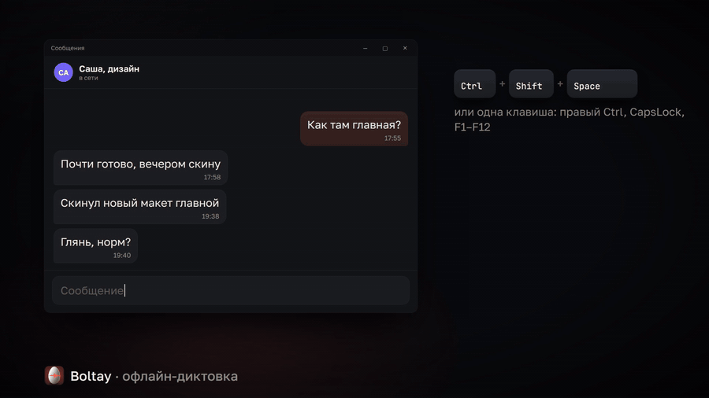
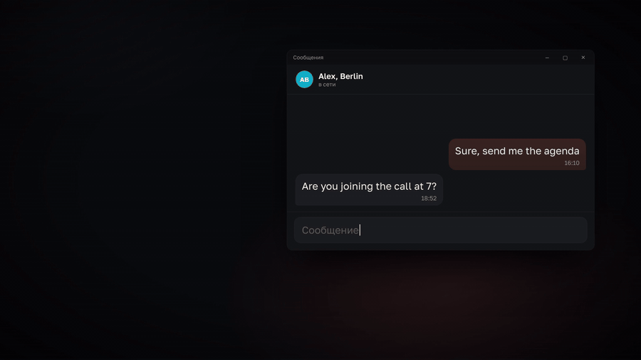
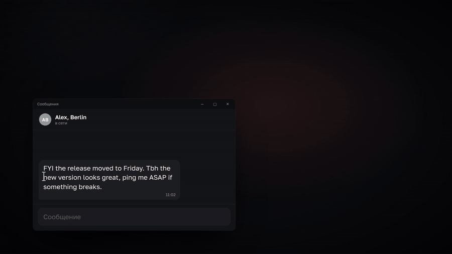

<p align="center"></p>

# Boltay

Voice dictation for Russian and English that runs on your own computer. Hold a hotkey, talk, let go: the text lands where your cursor is, with punctuation, without the "um"s, and nothing you say leaves the machine.

[Русская версия](README.ru.md)

## What it does

- **Russian and English speech.** Russian goes through [GigaAM v3](https://github.com/salute-developers/GigaAM), English through [Parakeet](https://huggingface.co/nvidia/parakeet-tdt-0.6b-v3). Ten seconds of speech take under a second on a desktop CPU. No GPU and no account. The network is only for downloading the models and a daily look for a new version, which you can turn off.
- **Text you don't have to fix.** Fillers like "ну", "короче", "типа" go away, spoken punctuation becomes punctuation ("запятая", "вопросительный знак", "новая строка", "абзац", "удали последнее"), brand names come out spelled right (GitHub, not "гитхаб"), swearing is kept, masked, cut or softened, as you like. Your own replacements and snippets on top.
- **Speak Russian, paste English.** A second hotkey dictates in Russian and pastes the English translation.
- **Translator on the selection.** Select text anywhere, press the hotkey: a small plate shows the translation, Russian to English or English to Russian, with slang and abbreviations explained. Copy it, or put it in place of the selection.
- **Voice messages and recordings to text.** Drop a file on the window: Telegram voice messages (ogg/opus), mp3, m4a, wav, flac, up to four hours long.
- **History** of what you dictated, if you want it, kept locally and pruned on schedule.

## How it looks

**Text you don't have to fix:** what was said, and what got pasted.


**Speak Russian, paste English.**



**Translator on the selection.**



**Voice messages to text.**


## Download

From [Releases](https://github.com/relaxcorp/boltay/releases/latest):

| System | File | First launch |
| --- | --- | --- |
| Windows 10/11 | `Boltay_*_x64-setup.exe` | SmartScreen may warn about an unknown publisher: More info → Run anyway. |
| macOS 13.4+, Apple Silicon | `Boltay_*_aarch64.dmg` | Drag Boltay to Applications and open it from there. macOS will refuse the first time: System Settings → Privacy & Security → Open Anyway. Then allow the microphone and Accessibility, the app asks for both. |
| Linux x64 | `Boltay_*_amd64.AppImage` or `.deb` | Built on Ubuntu 22.04, runs on it and newer. |

On first start Boltay downloads the speech model: 216 MB for Russian, 639 MB for English. Translation models come when you first translate: about 110 MB per direction, or about 560 MB for the quality ones.

Intel Macs are not supported: ONNX Runtime, which runs the models, no longer ships for them.

## Hotkeys

| | Windows | macOS, Linux |
| --- | --- | --- |
| Dictate | Ctrl+Shift+Space | Ctrl+Shift+Space |
| Dictate into English | Ctrl+Shift+Alt+Space | Ctrl+Shift+Alt+Space |
| Translator | Ctrl+Alt+T | Ctrl+Shift+Alt+T |

Hold to talk, or switch to press-to-start in the settings. With the latch on, a double press records hands-free until the next press. Esc cancels. On Windows a single key works too: right Ctrl, right Alt, right Shift or CapsLock.

**Wayland:** global hotkeys only fire while an X11 app has focus. Bind a system shortcut to `boltay-app --dictate` (or `--translate`, `--translator`) instead; each press starts or stops. Pasting there needs `wtype` or `ydotool`; without them Boltay shows the text with a Copy button.

## Building

You need Rust (stable), Node 22 and, on Linux, the packages from `scripts/linux-deps.sh`.

```sh
./scripts/fetch-models.sh                  # models for the tests, into ./models
cargo test --workspace
cd app && npm ci && npx tauri build
```

`cargo run -p boltay-cli -- transcribe file.wav --models models` runs recognition from the command line, `translate "текст" --models models` translates.

## License

MIT for the code. The models keep their own licenses (MIT, CC-BY-4.0, Apache-2.0); everything Boltay is built on is listed in [THIRD_PARTY_NOTICES.md](THIRD_PARTY_NOTICES.md). What the app sends over the network and how releases are signed: [CODE_SIGNING.md](CODE_SIGNING.md).

Made by [Relax Lab](https://relaxlab.net) · [Telegram](https://t.me/relaxdev)
